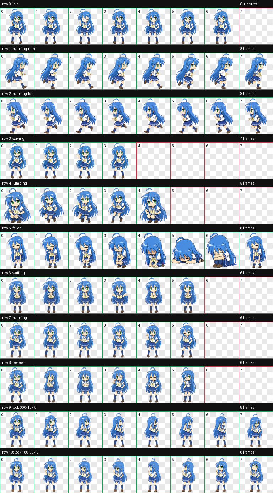

# Izumi Konata Codex Pet / 泉此方 Codex 宠物

[](https://github.com/hacksynth/codex-pet-izumi-konata/actions/workflows/ci.yml)
[](https://github.com/hacksynth/codex-pet-izumi-konata/actions/workflows/codeql.yml)

An animated Codex v2 pet based on Izumi Konata from *Lucky Star*.

基于《幸运星》泉此方制作的 Codex v2 动画宠物。



## Install / 安装

Download the latest release and copy `pet.json` and `spritesheet.webp` into:

下载最新 Release，将 `pet.json` 与 `spritesheet.webp` 复制到：

```text
~/.codex/pets/izumi-konata/
```

The package uses an 8 x 11 atlas with 192 x 208 pixel cells, 9 standard animation
states, 16 clockwise look directions, and `spriteVersionNumber: 2`.

该宠物使用 8 x 11 图集、192 x 208 像素单元格、9 种标准动画状态和 16 个顺时针观察方向。

## Validate / 校验

```bash
python -m pip install -e ".[dev]"
validate-codex-pet .
pytest
```

CI also runs Ruff and mypy. Visual semantics remain a human review gate; deterministic
checks cannot prove that a character is looking in the intended direction.

CI 还会运行 Ruff 与 mypy。视觉语义仍需人工审阅，确定性脚本无法证明角色确实看向目标方向。

## Repository files / 仓库文件

- `pet.json`, `spritesheet.webp`: installable pet package / 可安装宠物包
- `contact-sheet.png`, `look-directions.png`: visual review evidence / 视觉审阅证据
- `validation.json`, `direction-semantics.json`: QA records / QA 记录
- `src/`, `tests/`: deterministic validator and tests / 确定性验证器与测试

See [CONTRIBUTING.md](CONTRIBUTING.md) before opening a pull request. Use GitHub
Discussions for installation help and showcases.

提交 PR 前请阅读 [CONTRIBUTING.md](CONTRIBUTING.md)。安装答疑与展示请使用 GitHub Discussions。

## Licensing / 许可

Validator code, workflows, and documentation are available under the MIT License.
Character artwork and derived sprite assets are excluded; see [ASSET-NOTICE.md](ASSET-NOTICE.md).

验证代码、工作流和文档采用 MIT 许可证。角色图像与衍生精灵素材不在 MIT 授权范围内，详见
[ASSET-NOTICE.md](ASSET-NOTICE.md)。

This is an unofficial fan-made project. Izumi Konata and *Lucky Star* belong to their
respective rights holders. No affiliation or endorsement is implied.

本项目为非官方同人作品，与相关权利方不存在隶属或背书关系。
